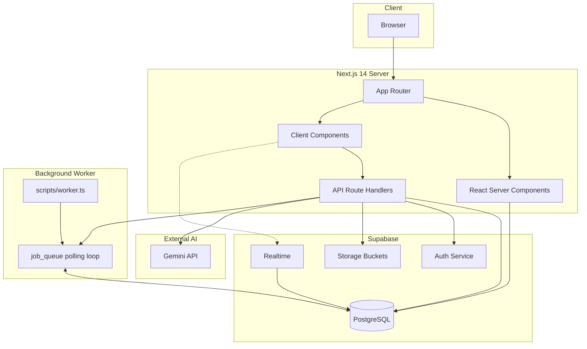
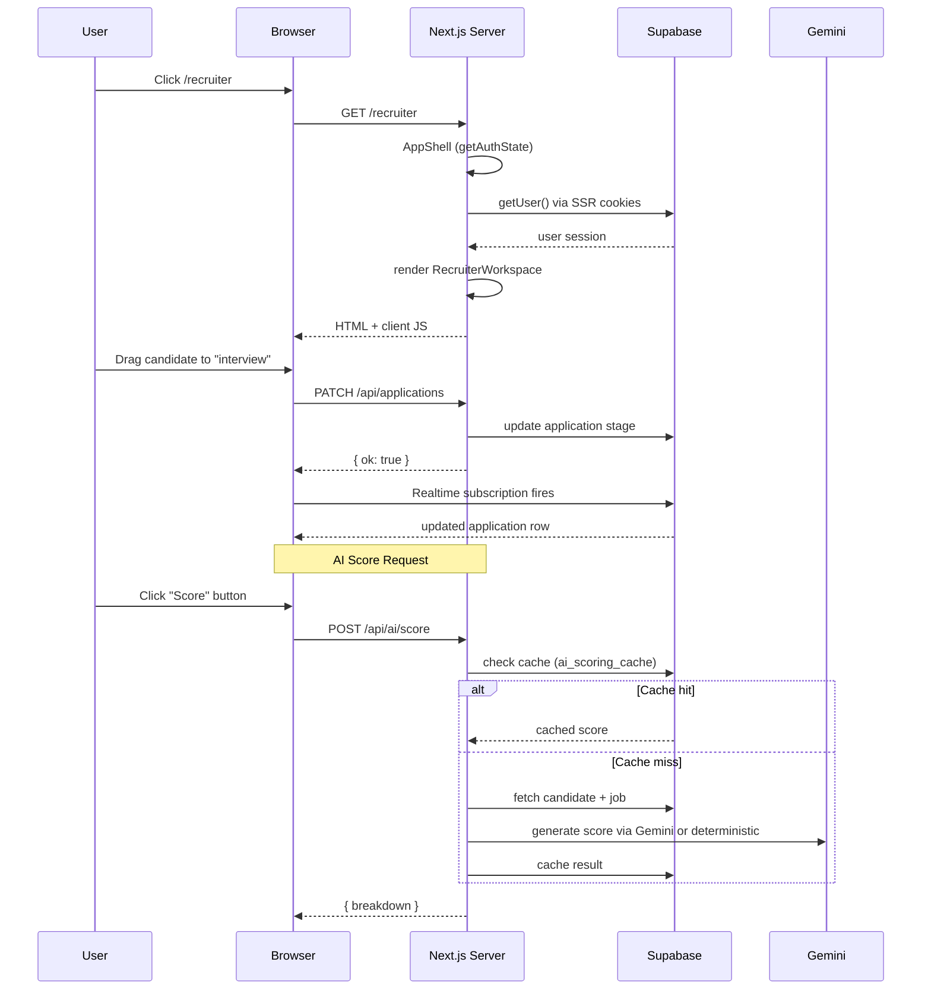
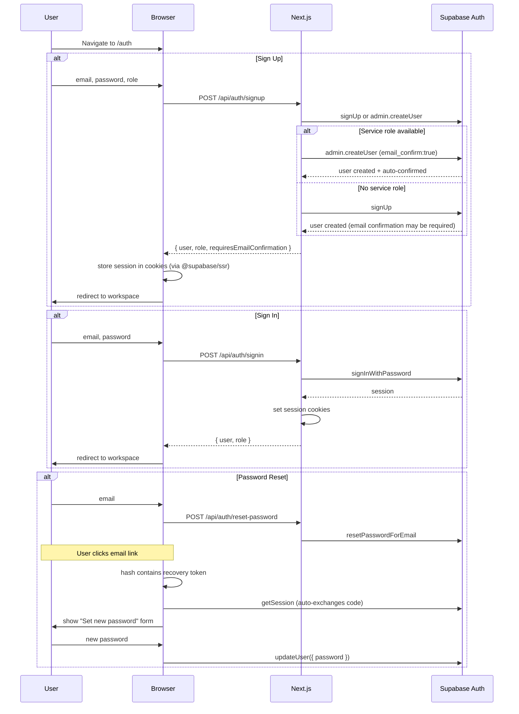
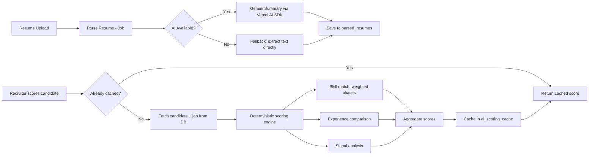
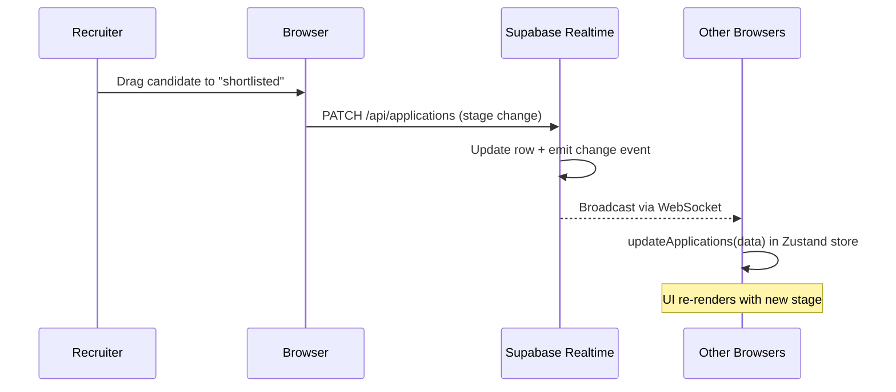
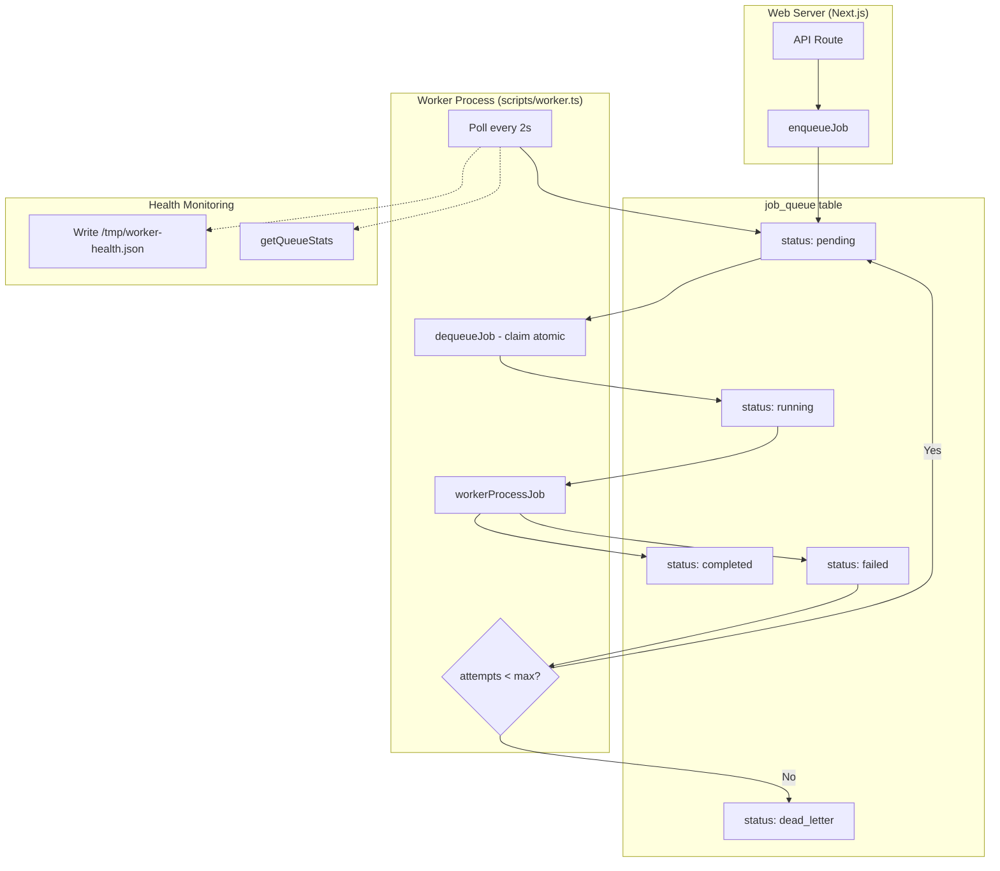
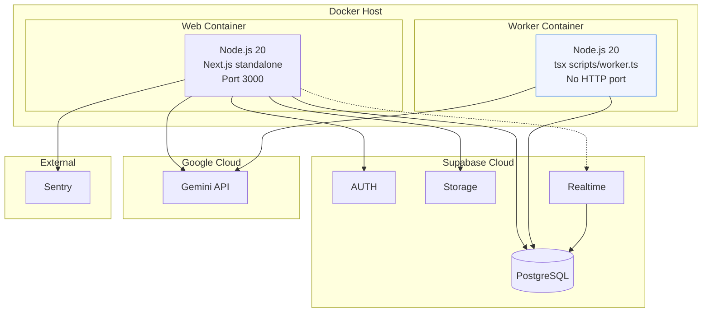

# Architecture

## System Overview

HireSight AI is a full-stack Next.js 14 application with a dedicated background worker process, Supabase for database/auth/storage, and Gemini AI for intelligent candidate matching.

---

## Request Flow

---

## Auth Flow

### Session Persistence

- Server-side: `createServerSupabaseClient()` reads the `sb-<project_ref>-auth-token` cookie via Next.js's `cookies()` API
- Client-side: `createBrowserClient()` from `@supabase/ssr` reads the same cookie from the browser
- Cross-tab: all browser tabs share HTTP cookies, so session is automatically available across tabs
- Refresh: the auth cookie persists across page refreshes (server reads it on every request)

### Demo Fallback

When `HIRESIGHT_DEMO_AUTH=true` and Supabase is not configured, the auth page falls back to `/api/auth/demo`, which sets a `hiresight_demo_role` cookie. `getAuthState()` checks demo cookies only when explicitly enabled, preventing silent bypass in production.

---

## AI Pipeline

### Deterministic Scoring

The scoring engine (`lib/ai/scoring.ts`) computes:

| Component | Weight | Description |
|-----------|--------|-------------|
| **Skill Score** | 40% | Matched skills with critical-skill bonus and semantic aliases |
| **Experience Score** | 35% | Years-of-experience proximity to job requirements |
| **Signal Score** | 25% | Video presence, profile completeness, confidence signals |

Strengths and weaknesses are derived from matched vs missing skills, with critical missing skills highlighted.

---

## Realtime Flow

Supabase Realtime broadcasts row-level changes to subscribing clients:

Tables published to `supabase_realtime`:
- `applications`
- `recruiter_notes`
- `uploads`
- `saved_jobs`
- `activity_log`

The `use-realtime` hook (`lib/use-realtime.ts`) wraps Supabase's channel subscription with cleanup and uses the SSR-aware client so auth sessions attach to realtime connections.

---

## Worker Architecture

### Job Handlers

| Handler | Type | Description |
|---------|------|-------------|
| `ai-score` | Registered | Fetches candidate + job, runs deterministic scoring, caches result |
| `parse-resume` | Registered | Placeholder for future async resume parsing |

### Retry Strategy

- Exponential backoff: `2^attempt * 1000ms` (2s, 4s, 8s)
- Max attempts: 3 (configurable via `maxAttempts` parameter)
- Dead-letter: after max attempts, status set to `dead_letter`
- Cleanup: completed/dead jobs older than 1 hour are deleted every 5 minutes

---

## Deployment Architecture

### Docker Setup

- **Dockerfile**: Multi-stage with `base` → `deps` → `builder` for Next.js, then two target stages:
  - `runner`: standalone Next.js server (port 3000)
  - `worker`: TypeScript worker via `tsx scripts/worker.ts`
- **docker-compose.yml**: Both services share env vars from `.env.production`. Worker depends on web health check.
